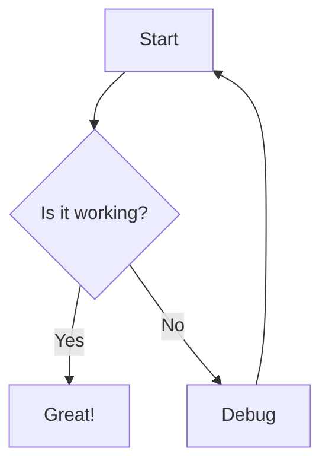

# Visual Aids Guide

This guide provides patterns and techniques for creating effective visual aids in documentation, including diagrams, file trees, and flowcharts.

## Why Visual Aids Matter

Visual aids help users:
- **Understand structure** - See how components fit together
- **Follow flows** - Trace data and process flows
- **Navigate codebases** - Understand directory organization
- **Learn faster** - Visual information is processed 60,000x faster than text
- **Remember better** - People remember 80% of what they see vs 20% of what they read

## File Tree Structures

### Basic File Tree

Use ASCII characters to show hierarchy:

```
project-root/
├── src/
│   ├── components/
│   ├── services/
│   └── utils/
├── tests/
├── public/
└── package.json
```

**Characters to use:**
- `├──` for branches (items with siblings below)
- `└──` for last item in a list
- `│   ` for vertical connection
- `    ` for indentation where no connection

### Annotated File Tree

Add inline comments to explain purpose:

```
project-root/
├── src/                    # Source code
│   ├── components/        # Reusable UI components
│   │   ├── common/       # Shared components (buttons, inputs)
│   │   │   ├── Button.tsx
│   │   │   └── Input.tsx
│   │   └── features/     # Feature-specific components
│   │       ├── auth/     # Authentication components
│   │       └── dashboard/ # Dashboard components
│   ├── services/          # Business logic and API calls
│   │   ├── api.ts        # API client configuration
│   │   └── auth.ts       # Authentication service
│   ├── utils/             # Helper functions
│   │   └── format.ts     # Formatting utilities
│   └── index.tsx          # Application entry point
├── tests/                 # Test files (mirrors src/)
│   └── components/
│       └── Button.test.tsx
├── public/                # Static assets (images, fonts)
│   ├── images/
│   └── fonts/
├── .env.example           # Environment variable template
├── package.json           # Dependencies and scripts
└── README.md              # Project documentation
```

### File Tree with File Sizes

Show relative importance or complexity:

```
project-root/
├── src/                    [12 files, 5,200 lines]
│   ├── components/        [8 files, 3,800 lines] ← Most of the code
│   ├── services/          [3 files, 1,200 lines]
│   └── utils/             [1 file, 200 lines]
├── tests/                  [8 files, 2,100 lines]
└── config/                 [3 files, 150 lines]
```

### File Tree with Change Indicators

Show what's new or modified:

```
project-root/
├── src/
│   ├── components/
│   │   ├── Button.tsx      ← Modified for v2.0
│   │   └── Modal.tsx       ✨ New in v2.0
│   └── services/
│       └── legacy.ts       ⚠️ Deprecated, use auth.ts instead
└── README.md               ← Updated installation steps
```

## System Architecture Diagrams

### Component Diagram

Show how major pieces fit together:

```
┌─────────────────────────────────────────────────────────┐
│                      Application                         │
│                                                          │
│  ┌─────────────┐      ┌─────────────┐      ┌─────────┐ │
│  │   Frontend  │      │   Backend   │      │ Database│ │
│  │   (React)   │◄────►│   (Node.js) │◄────►│(Postgres│ │
│  └─────────────┘      └─────────────┘      └─────────┘ │
│         │                     │                          │
│         │                     │                          │
│         ▼                     ▼                          │
│  ┌─────────────┐      ┌─────────────┐                  │
│  │   Browser   │      │  File Store │                  │
│  │   Storage   │      │    (S3)     │                  │
│  └─────────────┘      └─────────────┘                  │
└─────────────────────────────────────────────────────────┘
```

**Symbols:**
- `┌─┐` `│` `└─┘` - Boxes for components
- `◄────►` - Bidirectional communication
- `────►` - Unidirectional flow
- `▼` - Downward dependency

### Layered Architecture

Show architectural layers:

```
┌───────────────────────────────────────┐
│        Presentation Layer             │  ← User Interface
│     (React Components, Pages)         │
├───────────────────────────────────────┤
│         Application Layer             │  ← Business Logic
│    (Services, State Management)       │
├───────────────────────────────────────┤
│          Data Access Layer            │  ← Database Operations
│     (Repositories, ORMs, APIs)        │
├───────────────────────────────────────┤
│        Infrastructure Layer           │  ← External Services
│  (Database, Cache, Message Queue)     │
└───────────────────────────────────────┘
```

### Network Architecture

Show how services communicate:

```
Internet
   │
   ▼
┌─────────────────┐
│  Load Balancer  │
└────────┬────────┘
         │
    ┌────┴────┐
    │         │
    ▼         ▼
┌────────┐ ┌────────┐
│ Web    │ │ Web    │
│ Server │ │ Server │
│   #1   │ │   #2   │
└───┬────┘ └───┬────┘
    │          │
    └────┬─────┘
         ▼
   ┌──────────┐
   │   API    │
   │  Server  │
   └────┬─────┘
        │
   ┌────┴─────┐
   │          │
   ▼          ▼
┌──────┐  ┌───────┐
│ DB   │  │ Cache │
│(Primary) │(Redis)│
└──────┘  └───────┘
```

## Data Flow Diagrams

### Linear Flow

Show a simple sequence:

```
User Input → Validation → Processing → Storage → Response

[1] Form Submit  →  [2] Check Data  →  [3] Transform  →  [4] Save  →  [5] Success
```

### Branching Flow

Show conditional logic:

```
User Login Attempt
        │
        ▼
   Check Credentials
        │
   ┌────┴────┐
   │         │
   ▼         ▼
Valid?      Invalid?
   │           │
   │           ▼
   │      Show Error
   │           │
   │           ▼
   │      Retry Count++
   │           │
   ▼           ▼
Generate    Max Retries?
  Token          │
   │        ┌────┴────┐
   │        ▼         ▼
   │       Yes        No
   │        │         │
   │        ▼         └──► Return to Check
   │    Lock
   │    Account
   │
   ▼
Return Token
```

### Detailed Step Flow

Show exactly where things happen in code:

```
User Registration Flow:

[1] User submits form
    └─► components/RegistrationForm.tsx: handleSubmit()

[2] Validate input
    └─► utils/validation.ts: validateRegistrationData()

[3] Check email uniqueness
    └─► services/user.ts: checkEmailExists()
         └─► Makes API call: GET /api/users?email={email}

[4] Create user account
    └─► services/user.ts: createUser()
         └─► Makes API call: POST /api/users
              └─► Backend: api/users/route.ts: POST handler
                   └─► Database: INSERT INTO users

[5] Send welcome email
    └─► services/email.ts: sendWelcomeEmail()
         └─► External API: Sendgrid

[6] Update UI with success
    └─► components/RegistrationForm.tsx: setState({success: true})
```

### Sequence Diagram

Show interactions over time:

```
User            Frontend              Backend            Database
  │                │                     │                   │
  │─── Click ─────►│                     │                   │
  │                │                     │                   │
  │                │─── GET /api/data ──►│                   │
  │                │                     │                   │
  │                │                     │─── SELECT * ─────►│
  │                │                     │                   │
  │                │                     │◄─── Results ──────│
  │                │                     │                   │
  │                │◄─── JSON Response ──│                   │
  │                │                     │                   │
  │◄─── Display ───│                     │                   │
  │                │                     │                   │
```

## State Diagrams

Show state transitions:

```
Order State Machine:

     ┌─────────┐
     │ Created │ ← Initial state
     └────┬────┘
          │
          │ User clicks "Pay"
          ▼
    ┌──────────┐
    │ Pending  │
    │ Payment  │
    └─────┬────┘
          │
     ┌────┴────┐
     │         │
     │         │ Payment fails
     ▼         ▼
┌────────┐  ┌──────────┐
│  Paid  │  │ Cancelled│ ← Terminal states
└───┬────┘  └──────────┘
    │
    │ Items shipped
    ▼
┌───────────┐
│ Fulfilled │ ← Terminal state
└───────────┘
```

## Database Schema Diagrams

### Entity Relationship

Show table relationships:

```
┌──────────────┐         ┌──────────────┐
│    users     │         │    posts     │
├──────────────┤         ├──────────────┤
│ id (PK)      │────┐    │ id (PK)      │
│ email        │    │    │ user_id (FK) │────┐
│ name         │    └───►│ title        │    │
│ created_at   │         │ content      │    │
└──────────────┘         │ created_at   │    │
                         └──────────────┘    │
                                             │
                         ┌──────────────┐    │
                         │   comments   │    │
                         ├──────────────┤    │
                         │ id (PK)      │    │
                         │ post_id (FK) │◄───┘
                         │ user_id (FK) │
                         │ content      │
                         │ created_at   │
                         └──────────────┘

Relationships:
- User has many Posts (1:N)
- Post has many Comments (1:N)
- User has many Comments (1:N)
```

### Simple Table View

```
users table:
┌────┬──────────────────┬──────────┬────────────┐
│ id │ email            │ name     │ role       │
├────┼──────────────────┼──────────┼────────────┤
│ 1  │ alice@example.com│ Alice    │ admin      │
│ 2  │ bob@example.com  │ Bob      │ user       │
│ 3  │ carol@example.com│ Carol    │ user       │
└────┴──────────────────┴──────────┴────────────┘
```

## API Request/Response Flows

### REST API Flow

```
Client                          Server                       Database
  │                               │                              │
  │ GET /api/users/123            │                              │
  ├──────────────────────────────►│                              │
  │                               │                              │
  │                               │ SELECT * FROM users          │
  │                               │ WHERE id = 123               │
  │                               ├─────────────────────────────►│
  │                               │                              │
  │                               │          User data           │
  │                               │◄─────────────────────────────┤
  │                               │                              │
  │       200 OK                  │                              │
  │       {user data}             │                              │
  │◄──────────────────────────────┤                              │
  │                               │                              │
```

## Process Flowcharts

### Decision Tree

```
                    Start
                      │
                      ▼
             ┌────────────────┐
             │ User logged in?│
             └────────┬───────┘
                      │
            ┌─────────┴─────────┐
            │                   │
           Yes                 No
            │                   │
            ▼                   ▼
    ┌──────────────┐    ┌──────────────┐
    │ Show         │    │ Redirect to  │
    │ Dashboard    │    │ Login Page   │
    └──────┬───────┘    └──────────────┘
           │
           ▼
    ┌──────────────┐
    │ Has premium? │
    └──────┬───────┘
           │
    ┌──────┴──────┐
    │             │
   Yes           No
    │             │
    ▼             ▼
┌────────┐  ┌────────┐
│ Show   │  │ Show   │
│ All    │  │ Basic  │
│Features│  │Features│
└────────┘  └────────┘
```

## Module Dependency Graphs

### Simple Dependencies

```
pages/
  │
  └─► components/
        │
        ├─► hooks/
        │     │
        │     └─► services/
        │           │
        │           └─► utils/
        │
        └─► utils/
```

### Complex Dependencies

```
                  ┌──────────┐
                  │  pages/  │
                  └────┬─────┘
                       │
           ┌───────────┼───────────┐
           │           │           │
           ▼           ▼           ▼
    ┌──────────┐ ┌──────────┐ ┌──────────┐
    │components│ │  hooks/  │ │ services/│
    └─────┬────┘ └─────┬────┘ └─────┬────┘
          │            │            │
          └────────┬───┴────┬───────┘
                   ▼        ▼
              ┌────────────────┐
              │    utils/      │
              └────────────────┘

Legend:
─────► Direct dependency
```

## Timeline Diagrams

### Project Timeline

```
Q1 2024              Q2 2024              Q3 2024              Q4 2024
───┼───────────────────┼───────────────────┼───────────────────┼─────►
   │                   │                   │                   │
   ├─ v1.0 Release     ├─ v1.5 Release     ├─ v2.0 Release     ├─ v2.5
   │  • Basic features │  • API v2         │  • New UI         │  • Mobile
   │  • Core API       │  • Performance    │  • Webhooks       │  • Plugins
   │                   │                   │                   │
```

### Development Phases

```
Phase 1: Planning    Phase 2: Development    Phase 3: Testing    Phase 4: Launch
─────────────────────────────────────────────────────────────────────────────►
    2 weeks               6 weeks                3 weeks            1 week

│◄────────────►│◄───────────────────────────►│◄──────────────►│◄──────────►│
│              │                              │                │            │
│ • Research   │ • Feature development        │ • QA testing   │ • Deploy   │
│ • Design     │ • Code review                │ • Bug fixes    │ • Monitor  │
│ • Planning   │ • Unit tests                 │ • UAT          │ • Support  │
```

## Comparison Tables

### Feature Matrix

```
┌─────────────┬──────────┬──────────┬──────────┐
│   Feature   │ Plan A   │ Plan B   │ Plan C   │
├─────────────┼──────────┼──────────┼──────────┤
│ Storage     │ 10 GB    │ 100 GB   │ 1 TB     │
│ Users       │ 5        │ 25       │ Unlimited│
│ API Calls   │ 1,000/mo │ 10,000/mo│ Unlimited│
│ Support     │ Email    │ Email    │ 24/7     │
│ Price/month │ $10      │ $50      │ $200     │
└─────────────┴──────────┴──────────┴──────────┘
```

### Technology Comparison

```
┌────────────┬─────────┬─────────┬─────────┬─────────┐
│ Criteria   │ React   │ Vue     │ Angular │ Svelte  │
├────────────┼─────────┼─────────┼─────────┼─────────┤
│ Simplicity │ ★★★☆☆   │ ★★★★☆   │ ★★☆☆☆   │ ★★★★★   │
│ Performance│ ★★★★☆   │ ★★★★☆   │ ★★★☆☆   │ ★★★★★   │
│ Ecosystem  │ ★★★★★   │ ★★★★☆   │ ★★★★☆   │ ★★★☆☆   │
│ Jobs       │ ★★★★★   │ ★★★★☆   │ ★★★★☆   │ ★★☆☆☆   │
└────────────┴─────────┴─────────┴─────────┴─────────┘
```

## Best Practices

### Choose the Right Visual

| When you need to show... | Use... |
|--------------------------|--------|
| Code organization | File tree structure |
| System components | Architecture diagram |
| Process steps | Flow diagram or sequence diagram |
| Data movement | Data flow diagram |
| Conditional logic | Decision tree or flowchart |
| State changes | State diagram |
| Database structure | ER diagram |
| Module relationships | Dependency graph |
| Time-based changes | Timeline or Gantt chart |
| Feature comparison | Table or matrix |

### Keep It Simple

- **One concept per diagram** - Don't try to show everything
- **Limit complexity** - 5-7 items per diagram is ideal
- **Use consistent symbols** - Don't invent new notation
- **Label clearly** - Every box and arrow should be labeled
- **Add legends** - Explain any symbols used

### Make It Accessible

- **Use text descriptions** - Describe what the diagram shows
- **Provide alt text** - For accessibility tools
- **Use semantic formatting** - Code blocks for ASCII diagrams
- **High contrast** - Ensure diagrams are readable
- **Consider text-only** - Some readers can't see diagrams

### Test Your Visuals

- **Show to someone unfamiliar** - Can they understand it?
- **Print it out** - Does it work on paper?
- **View on mobile** - Is it readable on small screens?
- **Test with screen readers** - Is the content accessible?

## Tools for Creating Diagrams

### ASCII Art (Recommended for Documentation)

**Pros:**
- Works in any text editor
- Version control friendly
- Always renders correctly
- Accessible to screen readers

**Cons:**
- Time-consuming to create
- Limited visual appeal
- Hard to create complex diagrams

**When to use:** For simple diagrams in markdown documentation

### Mermaid (Code-Based Diagrams)



**Pros:**
- Text-based (version control friendly)
- Renders as nice graphics
- Supports many diagram types

**Cons:**
- Requires Mermaid renderer
- Learning curve for syntax
- Not all platforms support it

**When to use:** When your documentation platform supports Mermaid

### Draw.io / Lucidchart (Visual Tools)

**Pros:**
- Professional appearance
- Easy to create complex diagrams
- Many templates available

**Cons:**
- Binary files (not version control friendly)
- Requires separate tool
- Can become outdated

**When to use:** For complex diagrams or presentations

## Examples from Real Projects

### React Component Hierarchy

```
App
├── Header
│   ├── Logo
│   ├── Navigation
│   │   ├── NavItem
│   │   └── NavItem
│   └── UserMenu
├── Sidebar
│   ├── SidebarItem
│   └── SidebarItem
└── Content
    ├── Dashboard
    │   ├── StatsCard
    │   ├── Chart
    │   └── RecentActivity
    └── Footer
```

### Authentication Flow

```
1. User visits protected page
   └─► Check if token exists in localStorage

2. Token exists?
   ├─► YES: Validate token
   │   └─► Valid?
   │       ├─► YES: Allow access
   │       └─► NO: Redirect to login (expired token)
   │
   └─► NO: Redirect to login (not authenticated)

3. User logs in
   └─► POST /api/auth/login {email, password}
       └─► Success?
           ├─► YES: Store token in localStorage → Redirect to original page
           └─► NO: Show error message → Stay on login page
```

## Summary

Effective visual aids:
- **Clarify complex concepts** faster than text alone
- **Show relationships** between components
- **Guide users** through processes and flows
- **Organize information** spatially
- **Improve retention** of information

Choose diagrams that:
- **Match the concept** being explained
- **Stay simple** and focused
- **Use consistent notation**
- **Are accessible** to all users
- **Complement text** rather than replace it
