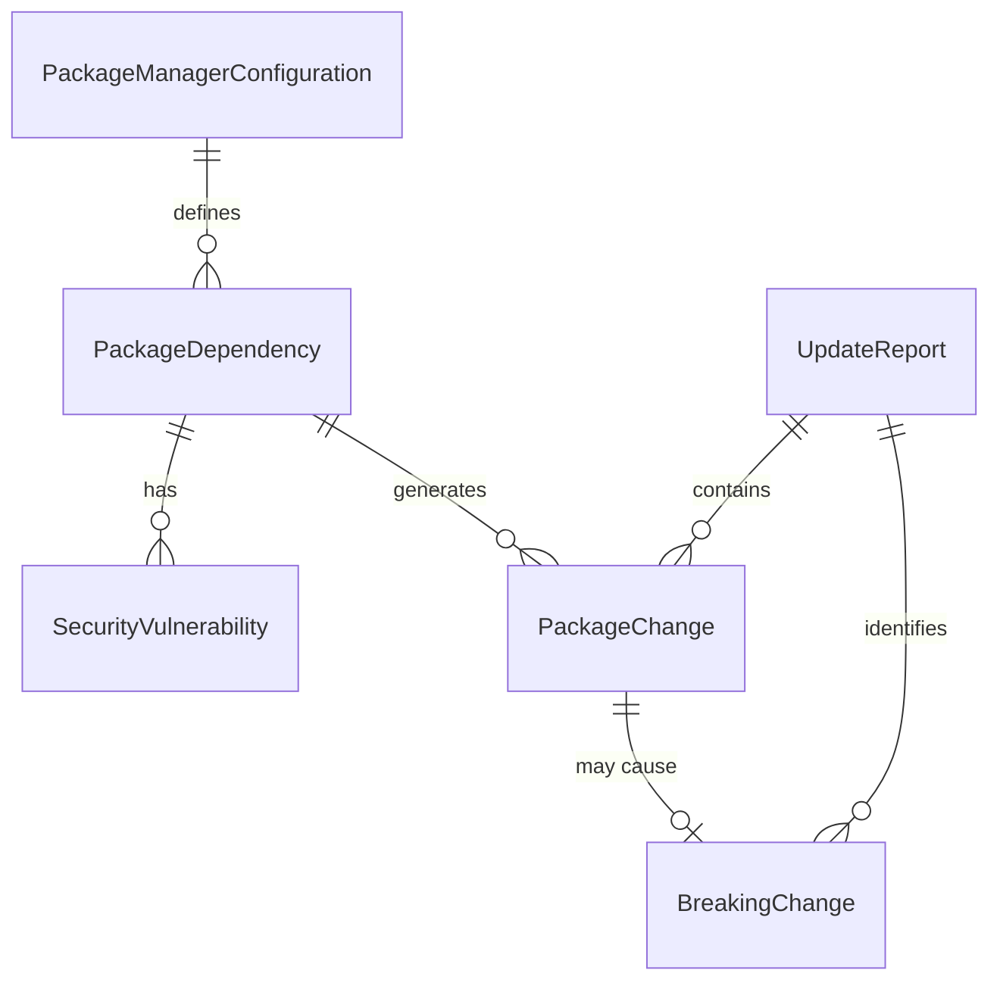

# Data Model: Package Updates and Security Resolution

## Entity Definitions

### PackageDependency
Represents a third-party library dependency in the project.

**Attributes**:
- `name`: string - Package identifier (e.g., "react", "@tauri-apps/api")
- `currentVersion`: string - Currently installed version (e.g., "19.1.1")
- `latestVersion`: string - Latest available version from registry
- `type`: enum - "dependency" | "devDependency" | "peerDependency"
- `isUsed`: boolean - Whether package is actively used in codebase
- `vulnerabilities`: Vulnerability[] - Array of known security issues
- `breakingChanges`: string[] - Known breaking changes in version updates
- `packageManager`: enum - "npm" | "bun" - Which manager installed it

**Validation Rules**:
- `name` must match npm package naming conventions
- `currentVersion` must be valid semver format
- `type` must be one of the three standard dependency types
- `vulnerabilities` array validated against CVE format

**State Transitions**:
```
Outdated → Updating → Updated
Vulnerable → Patching → Secured  
Used → Analyzing → Unused → Removing → Removed
```

### SecurityVulnerability
Represents a known security issue in a dependency.

**Attributes**:
- `id`: string - CVE identifier or security advisory ID
- `severity`: enum - "low" | "moderate" | "high" | "critical"
- `affectedVersions`: string - Version range affected (e.g., "<2.1.0")
- `patchedVersion`: string - First version with fix (e.g., "2.1.1")
- `description`: string - Human-readable vulnerability description
- `source`: enum - "npm" | "github" | "snyk" | "nvd"
- `publishedDate`: Date - When vulnerability was disclosed
- `fixAvailable`: boolean - Whether a patched version exists

**Validation Rules**:
- `id` must match CVE-YYYY-NNNN format or advisory format
- `severity` must be standard CVSS severity level
- `affectedVersions` must be valid semver range
- `publishedDate` must be valid ISO date

### PackageManagerConfiguration
Represents the lock files and manifests defining project dependencies.

**Attributes**:
- `packageJson`: object - Parsed package.json content
- `bunLockb`: object - Parsed bun.lockb content
- `packageLockJson`: object - Parsed package-lock.json (if exists)
- `syncStatus`: enum - "synced" | "divergent" | "conflict"
- `lastUpdated`: Date - When configuration was last modified
- `totalDependencies`: number - Count of all dependencies
- `devDependencies`: number - Count of development dependencies

**Validation Rules**:
- `packageJson` must contain required fields (name, version, dependencies)
- Lock files must reference packages defined in package.json
- `syncStatus` validated by comparing lock file contents

### UpdateReport
Represents the summary of changes made during update process.

**Attributes**:
- `timestamp`: Date - When update process completed
- `packagesUpdated`: PackageChange[] - List of packages that were updated
- `packagesRemoved`: string[] - List of packages that were removed
- `vulnerabilitiesFixed`: Vulnerability[] - Security issues resolved
- `breakingChanges`: BreakingChange[] - Changes requiring code updates
- `testsStatus`: enum - "passing" | "failing" | "unknown"
- `buildStatus`: enum - "success" | "failure" | "unknown"
- `duration`: number - Update process duration in seconds

**Validation Rules**:
- `timestamp` must be valid ISO date
- `packagesUpdated` array cannot be empty for successful updates
- `duration` must be positive number

### PackageChange
Represents a single package modification during update.

**Attributes**:
- `packageName`: string - Name of the changed package
- `fromVersion`: string - Previous version (null for new packages)
- `toVersion`: string - New version (null for removed packages)
- `changeType`: enum - "added" | "updated" | "removed" | "patched"
- `reason`: string - Why change was made (e.g., "security patch", "feature update")
- `hasBreakingChanges`: boolean - Whether change may break existing code

### BreakingChange
Represents a potentially breaking change requiring code updates.

**Attributes**:
- `packageName`: string - Package that introduced breaking change
- `fromVersion`: string - Previous version
- `toVersion`: string - New version  
- `changeDescription`: string - What changed that may break code
- `affectedFiles`: string[] - Files that may need updates
- `migrationSteps`: string[] - Steps to fix breaking change
- `resolutionStatus`: enum - "pending" | "in_progress" | "resolved"

## Relationships



## Data Flow

1. **Discovery**: Parse PackageManagerConfiguration to create PackageDependency entities
2. **Analysis**: Populate SecurityVulnerability data from audit tools
3. **Usage Detection**: Update `isUsed` flag via static analysis
4. **Update Planning**: Generate PackageChange entities for required updates
5. **Execution**: Process changes and create UpdateReport
6. **Breaking Change Tracking**: Create BreakingChange entities for follow-up tasks

This data model supports the complete dependency management lifecycle while maintaining traceability and enabling rollback scenarios.